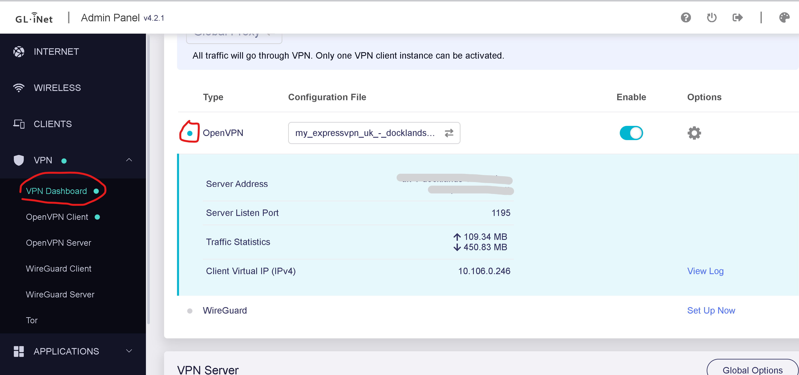

# 使用GL.iNet科学路由器科学上网

## 连上家里Wifi
1. 路由器插电，电脑连接到sci-fi网络（密码自寻）
2. 浏览器打开http://192.168.8.1

3. 点击switch network

4. 选择家里的Wifi，连上，然后你就能用路由器上网了（但还不能访问被和谐网站）。

## 连接机场

> 连接前需要断开Open VPN

需要开启科学路由器上的open clash。它有两个功能
* 连接机场，访问和谐网站
* 按规则分流，访问国内网站走直连（不经机场，节省机场流量），国际网站走机场

1. 在浏览器访问http://192.168.8.1/cgi-bin/luci/admin/services/openclash

（如果需要登录，用户名root，密码自寻）

登录成功能看到这个界面。目前open clash没有运行。

2. 开启open clash

3. 需要约半分钟。然后能看到这个界面，就说明连接成功。现在可以访问谷歌了。

## 连接Express VPN

> 连接前需要断开open clash

按下面指示开启VPN。节点选择Express VPN的英国节点。
